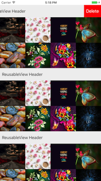

# PKCSwipeReusableView

[](https://travis-ci.org/pikachu987/PKCSwipeReusableView)
[](http://cocoapods.org/pods/PKCSwipeReusableView)
[](http://cocoapods.org/pods/PKCSwipeReusableView)
[](http://cocoapods.org/pods/PKCSwipeReusableView)

## Example





To run the example project, clone the repo, and run `pod install` from the Example directory first.

<br><br>

~~~~~

import PKCSwipeReusableView

class ReusableView: PKCSwipeReusableView{ }

class ViewController: UIViewController{

    override func viewDidLoad(){
        self.collectionView.register(ReusableView.self, forSupplementaryViewOfKind: UICollectionElementKindSectionHeader, withReuseIdentifier: "ReusableView")
        self.collectionView.dataSource = self
    }
    
    func collectionView(_ collectionView: UICollectionView, viewForSupplementaryElementOfKind kind: String, at indexPath: IndexPath) -> UICollectionReusableView {
        if kind == UICollectionElementKindSectionHeader{
            let reusableView = collectionView.dequeueReusableSupplementaryView(ofKind: kind, withReuseIdentifier: "ReusableView", for: indexPath) as! ReusableView

            reusableView.label.text = "ReusableView Header"
            let pkcButton1 = PKCButton(frame: .zero)
            pkcButton1.backgroundColor = .red
            pkcButton1.setTitle("Delete", for: .normal)
            reusableView.addRightSwipe(pkcButton1)
            pkcButton1.addTarget({ (button) in
                print(button)
            })
            if indexPath.section < 3{
                let pkcButton2 = PKCButton(frame: .zero)
                pkcButton2.backgroundColor = .green
                pkcButton2.setTitle("Save", for: .normal)
                reusableView.addLeftSwipe(pkcButton2)
            }
            return reusableView
        }else{
            assert(false, "Unexpected element kind")
        }
    }

    func collectionView(_ collectionView: UICollectionView, layout collectionViewLayout: UICollectionViewLayout, referenceSizeForHeaderInSection section: Int) -> CGSize {
        return CGSize(width: UIScreen.main.bounds.width, height: 50)
    }

}

~~~~~

## Installation

PKCSwipeReusableView is available through [CocoaPods](http://cocoapods.org). To install
it, simply add the following line to your Podfile:

```ruby
pod "PKCSwipeReusableView"
```

## Author

pikachu987, pikachu77769@gmail.com

## License

PKCSwipeReusableView is available under the MIT license. See the LICENSE file for more info.
